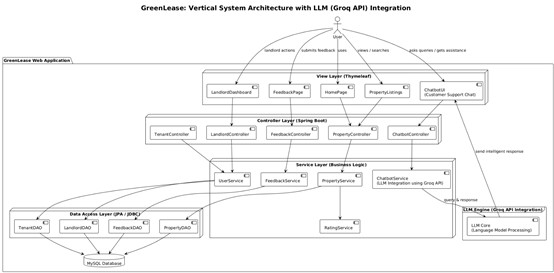
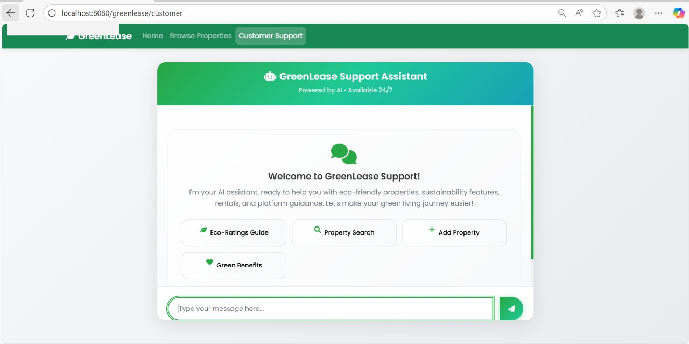
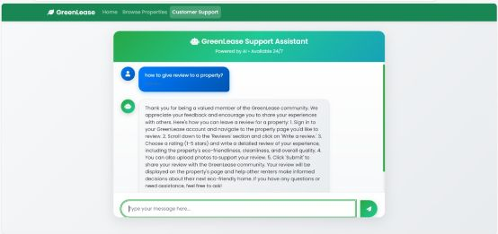

# GreenLease: Eco-Rating System for Rental Properties

## Project Overview

**GreenLease** is a web app that helps renters find eco-friendly rental homes using an eco-rating system. It scores properties based on things like solar power, insulation, water saving, and green surroundings. Renters can search for greener homes, and landlords are encouraged to improve their property’s sustainability.

### Problem Statement
Renters are increasingly interested in selecting homes based on energy efficiency and sustainability. GreenLease addresses this need by creating a Java-based listing platform that rates properties on criteria such as:
- Insulation quality
- Solar panel usage
- Water conservation features
- Proximity to green spaces
- Overall energy efficiency

## Key Features

### 1. Property Eco-Rating System
- **Insulation Rating** (1-10): Thermal efficiency assessment
- **Solar Panel Integration**: Availability and rating of solar systems
- **Water Conservation** (1-10): Water-saving features and fixtures
- **Energy Efficiency** (1-10): Overall energy performance
- **Green Space Proximity**: Distance to parks and green areas
- **Overall Eco Score**: Calculated composite sustainability score

### 2. Property Search & Filtering
- Search by city and location
- Filter by rent range
- Filter by eco-score range
- Solar panel availability filter
- Property type filtering

### 3. Tenant Feedback System
- 5-star overall rating system
- Eco-specific ratings for each green feature
- Written reviews and recommendations
- Verified tenant feedback
- Aggregated statistics and analytics

### 4. Landlord Dashboard
- Property listing management
- Sustainability score tracking
- Tenant feedback monitoring
- Eco-feature showcase tools


### Challenge Features
- **Spring Boot Framework** - Complete MVC-based web application
- **Thymeleaf** - Server-side rendering and front-end design
- **JDBC** - Database connectivity with MySQL/PostgreSQL support
- **Eco-Rating System** - Comprehensive property sustainability scoring
- **Tenant Feedback** - Review and rating system for properties
- **Landlord Incentives** - Sustainability scoring for property owners

## Technology Stack

- **Backend**: Spring Boot 3.1.5 (Java 17)
- **Frontend**: Thymeleaf, HTML
- **Database**: MySQL
- **Build Tool**: Maven
- **Architecture**: Model-View-Controller (MVC)

## Prerequisites

- Java 17 or higher
- Maven 3.6+
- MySQL 8.0+ (or PostgreSQL 12+)
- IDE of choice (IntelliJ IDEA, Eclipse, VS Code)

---

## Implementation Output

### **Architecture Diagram**


### **Customer Support Chatbot**


### **Chat Query Example**


### **Project Demo Video**
[Watch GreenLease Demo](https://raw.githubusercontent.com/yuvashree031/GreenLease-Eco-Friendly-Homes/master/output/GreenLease_Eco_Friendly_Homes.mp4)

---


## Project Structure

```
src/
├── main/
│   ├── java/com/greenlease/
│   │   ├── GreenLeaseApplication.java          # Main application class
│   │   ├── controller/                         # MVC Controllers
│   │   │   ├── PropertyController.java         # Property listing & search
│   │   │   └── FeedbackController.java         # Tenant feedback system
│   │   ├── model/                              # Entity models
│   │   │   ├── Property.java                   # Property entity
│   │   │   ├── Landlord.java                   # Landlord entity
│   │   │   └── Feedback.java                   # Feedback entity
│   │   ├── repository/                         # JDBC repositories
│   │   │   ├── PropertyRepository.java         # Property data access
│   │   │   └── FeedbackRepository.java         # Feedback data access
│   │   └── service/                            # Business logic
│   │       ├── PropertyService.java            # Property services
│   │       └── FeedbackService.java            # Feedback services
│   └── resources/
│       ├── application.properties              # App configuration
│       ├── schema.sql                          # Database schema & sample data
│       ├── static/                             # Static web assets
│       │   ├── css/style.css                   # Custom styles
│       │   └── js/app.js                       # JavaScript functionality
│       └── templates/                          # Thymeleaf templates
│           ├── index.html                      # Home page
│           ├── layout.html                     # Common layout
│           ├── properties/                     # Property views
│           │   ├── list.html                   # Property listing
│           │   ├── detail.html                 # Property details
│           │   └── add.html                    # Add property form
│           └── feedback/                       # Feedback views
│               └── add.html                    # Feedback form
```
